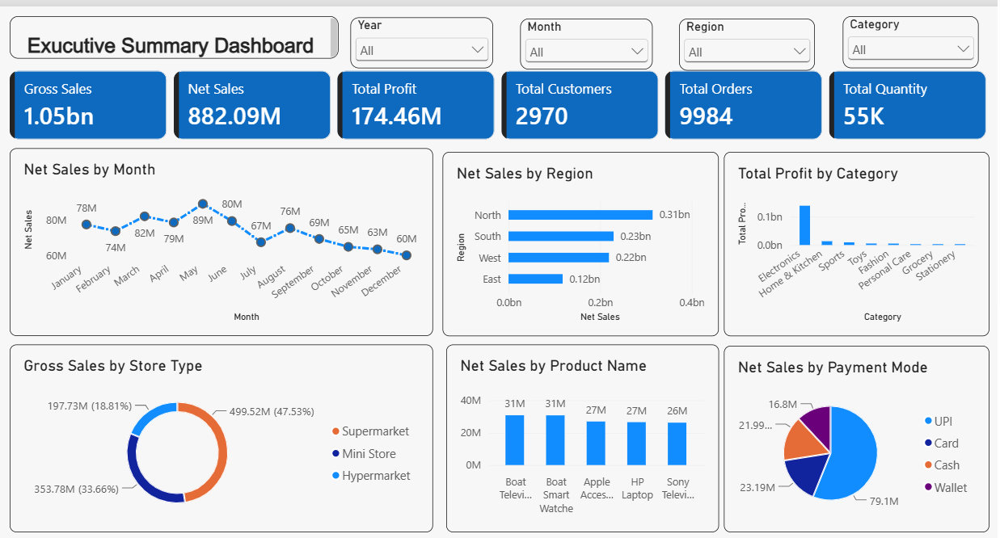

# 📊 Executive Summary Dashboard – Power BI

## 📌 Project Overview

This interactive Executive Summary Dashboard was created as part of a hands-on Power BI workshop conducted by Satish Dhawale Sir, Founder of SkillCourse.

The dashboard transforms business data into meaningful visual insights related to sales, profit, customers, orders, quantity, regions, categories, products, store types and payment modes.

## 🛠️ Tools & Technologies

- Microsoft Power BI
- Power Query
- DAX
- Data Modeling
- Data Visualization

## 📊 Dashboard Features

- Gross Sales
- Net Sales
- Total Profit
- Total Customers
- Total Orders
- Total Quantity
- Monthly Sales Analysis
- Regional Sales Analysis
- Category-wise Profit Analysis
- Store Type Analysis
- Product-wise Sales Analysis
- Payment Mode Analysis
- Interactive Slicers and Filters

## 📸 Dashboard Preview

## 📚 Skills Practiced

Power BI | Power Query | DAX | Data Modeling | Data Visualization | Dashboard Development | Data Analysis

## 🎓 Learning Experience

This hands-on workshop helped me understand the complete Data-to-Dashboard workflow, including data import, data cleaning, data modeling, DAX calculations and interactive dashboard development.

I am continuing to strengthen my skills in Power BI, SQL, Python, Excel and Data Analytics.
